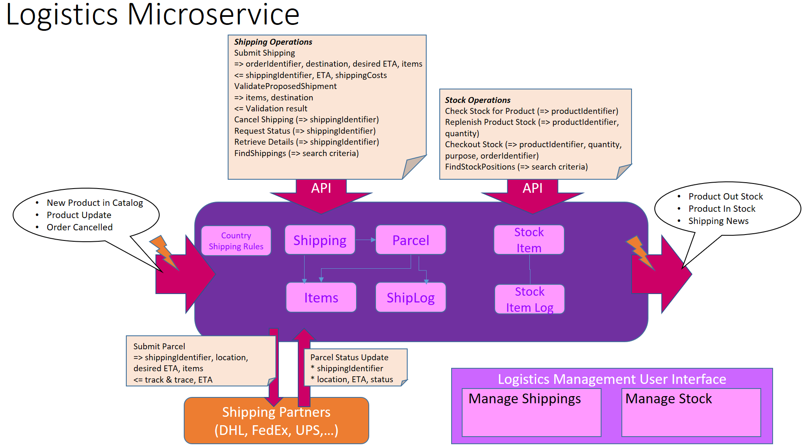
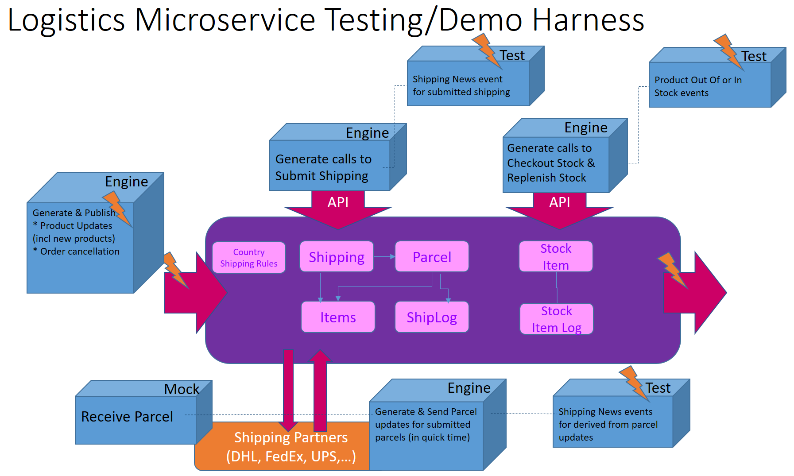
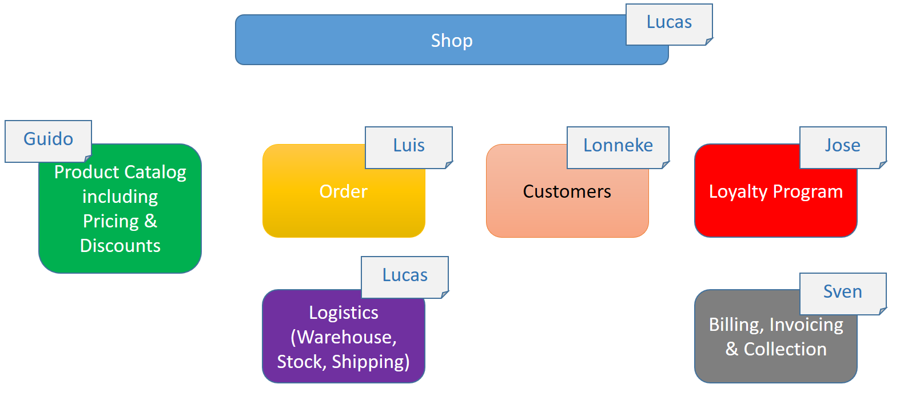

## The Logistics Microservice

The repo for the Logistics Microservice for [the Soaring through the Cloud - The Sequel](https://github.com/lucasjellema/soaring-through-the-cloud-native-sequel)

Here is the visual overview of the Logistics MS - its APIs, Events, User Interfaces and (high level) internals:

The design of the API is on [Apiary](https://logisticsmicroservice.docs.apiary.io/#)

In order to test the Logistics MS on its own, we need to create a harness:
* a mock implementation of the 3rd party parcel handler service
* generators (engines) to make calls to submit shippings and update product stock and publish events for product updates and cancelled orders
* tests to verify if the expected events are published - the product out of/back in stock event and the shipping news event
* tests to verify if the events and service calls have the intended effect (shipping status, stock status)

The Logistics Microservice is one of several services in the WebShop company (yet to be named):

The Logistics Microservice leverages the following environment variables:

- name: APP_PORT - the port on which the MS is listening; the default is 8096
- name: ELASTIC_CONNECTOR - the endpoint for the Elastic Search instance used as a backend by the MS ; for example http://129.150.114.134:9200 
- name: EVENT_HUB_HOST - the URL endpoint for the Event Hub (the Kafka server on which events are published and consumed); for example: 129.150.77.116 
- name: SOARING_PRODUCTS_TOPIC_NAME  - the Kafka Event Topic from hwich the MS consumes events regarding products (new and changed product details)
- name: SOARING_SHIPPINGNEWS_TOPIC_NAME - the Kafka Event topic to which events are published regarding shipping products; for example: a516817-soaring-shipping-news 

The Logistics MS will publish events:
topic: SOARING_SHIPPINGNEWS_TOPIC_NAME  for events of type shipping-news-event

and consume events:
topic: SOARING_PRODUCTS_TOPIC_NAME for events regarding new and changed products

To run the Logistics Microservice, we can make use of the generic Node application running Docker Container:

docker run --name logistics-ms -p 3006:3001 -p 4500:4500  -e APPLICATION_ROOT_DIRECTORY=logistics-ms -e APP_PORT=3001 -e ELASTIC_CONNECTOR=http://129.156.113.125:9200 -e EVENT_HUB_HOST=129.156.113.171 -e SOARING_SHIPPINGNEWS_TOPIC_NAME=idcs-1d61df536acb4e9d929e79a92f3414b5-soaringshippingnews -e SOARING_PRODUCTS_TOPIC_NAME=idcs-1d61df536acb4e9d929e79a92f3414b5-soaringproducts -e GITHUB_URL=https://github.com/lucasjellema/logistics-microservice-soaring-clouds-sequel -d lucasjellema/node-run-live-reload:0.4.2

And to run on Kubernetes, see folder k8s

## Database
The Logistics MS leverages an Elastic Search backend, with these indexes:
* shipping - an index that contains the shippings that take place in order to deliver the items in an order; a shipping goes through several statuses before it is eventually delivered (or canceled/failed/lost)
* warehouse - an index that holds the stock changes for every product (and is used to derive the current stock)
* products - a read only replica of the products in the Products MS

